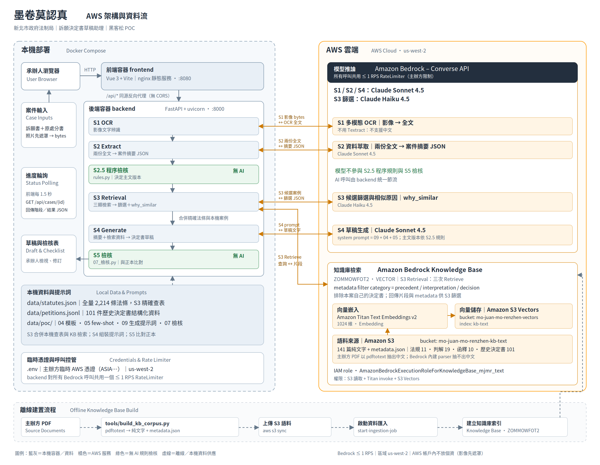

# 莫捲莫認真｜訴願決定書草稿助理

> 新北市 AI 黑客松・法制局題目「訴願決定書草稿」。承辦人上傳訴願書與原處分書的照片，約 2 分鐘後取得一份**每一個引用都能點回來源**的決定書草稿；結論由程序規則決定，模型只負責撰寫理由；個資不出本機。

| | |
|---|---|
| 線上系統 | https://drod66yo9d2zo.cloudfront.net/ （帳密另行提供；登入後按「一鍵 Demo（載入並分析）」） |
| 展示影片（4:59） | https://youtu.be/pfJ2o0RFwcM |
| 簡報 | 線上系統 `/slides/` |
| 驗證成績 | 真實案例 113 年第 16 號洗錢防制法告誡案：與正本比對 31 項檢核 **29／31**，11 筆引用 **全部可溯源**，全鏈 **100–120 秒** |
| 歷史資料 | 新北市法制局 2004–2026 訴願決定書 **26,607 篇**（官方同意取得）＋主辦方 141 篇法規／判解／函釋／決定書 |

## 評審 3 分鐘導覽

1. 開線上系統 → 登入 → **「一鍵 Demo（載入並分析）」**：載入模擬的訴願書與書面告誡（人名帳號皆虛構），六個階段即時亮起，約 2 分鐘完成。
2. **文字對照**：辨識文字旁的標籤顯示「個資已遮罩」——姓名已成代號「甲○○」，身分證／電話／地址被遮罩，之後送模型的都是這個版本。
3. **程序檢核**：訴願法 14 條 30 日、77 條第 3 款當事人適格、第 8 款行政處分、行政程序法 96 條記載事項——每項附判斷依據，需人工確認者標黃。
4. **法源檢索**：法條、判解、立法理由、相似案四類；頂端顯示「歷史同案型 757 篇：駁回 43%、撤銷 3%、不受理 54%」。
5. **決定書草稿**：每段理由旁的引用 chip 點下去就是原文；右側「待補查」列出草稿引用了但檢索裡沒有的東西。可「編輯草稿 → 儲存版本」、版本下拉還原 AI 原稿、匯出 PDF／Word。
6. 想看**規則如何改變結論**：文件上傳頁把「送達日期」改成 40 天前再分析 → 程序判定逾期 → 主文變「訴願不受理」並引訴願法 77 條第 2 款。

## 命題對照

| 命題的四項工具 | 本系統對應 | 由誰決定 |
|---|---|---|
| 案件擷取分類 | S1 OCR → S2 結構化擷取（訴願人、機關、處分文號／日期／依據、送達日、提起日、案由、主張、爭點）＋ S2.5 程序檢核 | 模型擷取，**規則檢核** |
| 法規推薦 | S3：處分依據精確查表 ∪ 相似案裁決依據 ∪ 判解主題條文 ∪ **同案型歷史高頻條文**（26,607 篇統計） | 規則＋索引 |
| 相似案比對 | S3：Knowledge Base 向量檢索（主辦方 101 件＋網站版 26,607 篇），排除本案自己的決定書，模型為每件寫一句「為何相似」 | 向量＋模型篩選 |
| 草稿生成 | S4：**主文版本由 S2.5 決定**，模型依模板與 few-shot 撰寫事實與理由；S5 與正本比對 31 項 | **規則定結論**，模型寫理由 |

---

## 1. 問題

新北市訴願案量由 110 年 1,238 件成長到 114 年 1,566 件；洗錢防制、廢棄物清理、空氣污染等大宗案型論理高度重複，但每一份決定書仍由承辦人逐件撰擬。承辦人真正需要的不是「一段像決定書的文字」，而是**有依據、可核對、程序不出錯**的初稿：引用要能回到法條與判決原文，逾期、當事人不適格、處分書記載瑕疵這些程序問題要先被抓出來，個資不能離開機關。

## 2. 解法：六階段管線，規則把關、模型撰寫

```
影像 ─▶ S1 OCR ─▶ S2 案件擷取 ─▶ S2.5 程序檢核 ─▶ S3 法源檢索 ─▶ S4 草稿生成 ─▶ S5 正本比對檢核
        Claude     Claude        純規則          KB 向量＋索引    Claude（串流）    純規則（31 項）
```

| 階段 | 做什麼 | 由誰決定 |
|---|---|---|
| S1 OCR | 兩份文件影像 → 全文；低信心段落標註 | Claude（Bedrock Converse） |
| **個資取代** | S1 之後、任何文字送模型之前：姓名→「甲○○」，身分證／電話／地址／生日遮罩；對照表只存在後端記憶體 | 規則 |
| S2 擷取 | 訴願人、機關、處分文號／日期／依據、送達日、提起日、案由、主張、爭點 → 結構化 JSON；日期正規化、缺漏欄位由規則自原文補 | Claude＋正規化規則 |
| **S2.5 程序檢核** | 訴願法 14 條 30 日（含休息日順延、寄存送達、在途期間提示）、77 條第 3 款當事人適格、第 8 款是否為行政處分、行政程序法 96 條處分書應記載事項 | **純規則，不經模型** |
| S3 檢索 | 法條精確查表；判解／函釋／歷史決定書向 Knowledge Base 三次 Retrieve，模型篩掉主題無關者；依案由補同案型歷史高頻條文；回傳同案型裁決分布；排除本案自己的決定書 | KB＋索引＋Claude 篩選 |
| S4 生成 | **主文版本（駁回／撤銷／不受理）由 S2.5 結果決定**，模型依模板與 few-shot 撰寫事實與理由；引用只認 S3 結果，寫了檢索裡沒有的判決就列入「待補查」；輸出後還原真名 | 規則定結論，Claude 寫理由 |
| S5 檢核 | 段落、格式、結論、事實、引用、論理、防幻覺 7 組 31 項，與正本比對 | 純規則 |

**同一組文件、三種結論**：把送達日期改早 → 程序規則判定逾期 → 不受理（77 條第 2 款）；處分書事實欄空白 → 抓到記載瑕疵 → 撤銷（行政程序法 96 條）；否則 → 駁回（訴願法 79 條）。模型不能自創第四種結論。

## 3. 可信與合規

| 原則 | 實作 |
|---|---|
| 結論不交給模型 | 主文、教示、表頭由規則覆寫；模型輸出的 citations 不採信，一律由本文比對檢索結果重新產生 |
| 引用可溯源 | 草稿每段理由旁有引用 chip，點一下看到法條／判決／立法理由原文；缺依據的引用列為「需承辦人補查」 |
| 不編造 | 113-16 正本引用了 LINE 對話截圖內容，輸入文件裡沒有 → 系統不寫，這是少的 2 分 |
| 個資不出本機 | AWS 帳戶內不放個資，S2–S4 送模型的全是代號版；對照表只在記憶體、不進資料庫；草稿輸出時本機還原 |
| 主辦方規範 | Bedrock 所有呼叫共用 ≤ 1 RPS 限流、S3 Block Public Access、指定區域 us-west-2、憑證走 `.env` 不進 git、模型帳戶不可用時自動降級並在 `/api/health` 標示 |
| 承辦人語言 | 介面與待補查說明以白話中文呈現，不出現內部欄位名或階段代號 |
| 人在迴路 | 草稿標示「待人工審閱」，程序檢核需人工確認項標黃，匯出前有審閱勾選；草稿版本化保留誰改了什麼 |

## 4. 承辦人工作台

- 六步驟導覽：上傳 → 文字對照 → 程序檢核 → 法源檢索 → 決定書草稿 →（正本比對，開發者檢視）。分析中以 WebSocket 即時顯示子步驟與草稿逐字串流，連不上自動退回輪詢。
- **我的案件**：案件、影像、六階段結果、草稿版本存在 PostgreSQL，重啟後仍可回到同一案件；影像可回看。
- **草稿編輯與版本**：逐段修改 → 儲存為新版本（含備註、修改者）；版本下拉切換或還原 AI 原稿；匯出 PDF／Word 使用目前版本。
- **歷史統計**：法源頁顯示同案型歷史決定書的裁決分布；法條標示「同案型 N 篇中 M% 引用」。
- 送達日期可由承辦人填寫覆蓋（民國格式）；字級可調；RWD；帳密登入。

## 5. 架構



| 元件 | 用途 |
|---|---|
| CloudFront → 彈性 IP → EC2 t3.large | 對外 HTTPS 子網域；EC2 上 Docker Compose 跑 `frontend`（nginx＋Vue 3）、`backend`（FastAPI）、`db`（PostgreSQL 16）、`slides`；SG 只開 22/80/443 |
| Amazon Bedrock Converse API | S1／S2／S3 篩選／S4 四段；預設 Claude Sonnet 5，帳戶不可用時自動降級 Sonnet 4.6；S4 走串流 |
| Bedrock Knowledge Base `ZOMMOWFOT2` | Titan Text Embeddings v2 → S3 Vectors；語料為純文字＋metadata（category／year／case_type／outcome／doc_no 可過濾）；主辦方 PDF 以 pdftotext 重建，避免內建 parser 中文亂碼 |
| 本機資料 | `statutes.json` 2,214 條全文、`precedents.json`、`petitions.jsonl`（主辦方 101 件結構化）、`law_index.json`（63 個案型 → 高頻條文與裁決分布）、`decisions_slim.jsonl.gz`（26,607 篇精簡索引） |

後端 API：`POST /api/cases`（上傳）、`GET /api/cases`／`{id}`、`WS /api/cases/{id}/ws`（即時進度）、`GET .../files/{field}`（影像回看）、`PUT .../draft`、`GET .../drafts`／`current`／`{v}`、`POST .../drafts/{v}/restore`、`POST /api/login`、`GET /api/health`。階段 JSON 契約凍結於 [data/poc/03_介面規格.md](data/poc/03_介面規格.md)。
詳細：[docs/aws-architecture.md](docs/aws-architecture.md)、[backend/README.md](backend/README.md)、[f2e/README.md](f2e/README.md)。

## 6. 資料：26,607 篇歷史決定書

- 來源：新北市法制局訴願決定書查詢系統（官方同意），`backend/tools/crawl_ntpc_appeals.py` 13 分鐘抓完，可增量更新；原始資料不進 repo，精簡索引 10.6 MB 隨後端部署。
- 用途：匯入 Knowledge Base 作相似案檢索；統計成法條索引補進 S3；提供裁決分布。
- 統計摘要：整體駁回 56%／不受理 34%／撤銷 10%；不受理以 77 條第 6 款（原處分已不存在）3,581 件、第 2 款（逾期）2,281 件最多；前五大案型：廢棄物清理法 6,657、空氣污染防制法 2,878、建築法 1,786、噪音管制法 1,306、地價稅 1,273。
- 發現：網站「相關法條」欄位只列程序法，實體條文需從全文抽取；索引已兩者兼備。
- 報告：[量化](docs/ntpc_appeals_analysis.md)（年度／案型／機關／條文／77 條款次）、[質性](docs/ntpc_appeals_qualitative.md)（駁回論證骨架、撤銷理由五分類、77 條分流要件、檢索優先序、生成規則）。

## 7. 驗證與測試

| 項目 | 結果 |
|---|---|
| 113-16 正本比對（bedrock 模式） | S5 29／31（段落 5/5、格式 9/9、結論 3/3、事實 1/1、引用 2/4、論理 4/6、防幻覺 3/3）；引用 11／11 有據 |
| 三種結論切換 | 改送達日 → 不受理；事實欄空白 → 撤銷；皆由規則觸發並附條款 |
| 個資 | S1–S3 輸出完全不含原值；S4 還原姓名；四項程序檢核在代號版下照樣成立 |
| 後端 | pytest 135 項：規則引擎（30 日、休息日順延、寄存送達、77 條各款、96 條）、管線、API、登入、個資、WebSocket、持久層 |
| 前端 | vue-tsc build；Playwright 煙霧測試（案件列表、影像回看、草稿版本、還原） |
| 端到端 | Docker Compose bedrock 模式 110 秒全通；重啟後案件與草稿仍在 |

## 8. 快速啟動

```bash
cp .env.example .env            # stub 模式（離線，正本改寫、非 AI 生成）留預設；bedrock 模式填 ADAPTER=bedrock 與 AWS 憑證
docker compose up --build       # http://localhost:8080 ；/api、/slides/ 由 nginx 代理；db 為 PostgreSQL（volume pgdata）
```

本機開發：`backend` 建 venv 後 `uvicorn app.main:app --reload --port 8000`（`pytest -q` 跑測試）；`f2e` 執行 `npm install && npm run dev`（http://localhost:5173 ）。
部署更新：`git pull origin main && docker compose up -d --build`；主辦方臨時 token 過期時換 `.env` 三個 `AWS_*` 再 `docker compose up -d --force-recreate backend`。
**stub 模式輸出＝工作包正本改寫，不是 AI 生成**；bedrock 模式才是真的 Claude 生成。

## 9. 專案結構

```text
f2e/        Vue 3 + Vite + TypeScript 前端（案件工作台、案件列表、草稿版本、PDF／Word 匯出）
backend/    FastAPI：app/pipeline.py 六階段、rules.py 程序規則、pii.py 個資取代、adapters/bedrock.py 四段 AWS、
            law_index.py／decisions.py 歷史索引、db.py 持久層；tools/ 爬蟲、分析、KB 語料建置
data/       poc/ 工作包（凍結契約、模板、few-shot、31 項檢核器）；statutes.json、precedents.json、petitions.jsonl、
            law_index.json、decisions_slim.jsonl.gz
docs/       AWS 架構圖、決定書分析報告、儲存層設計
slides/     Slidev 簡報
video/      影片產線（Playwright 錄製、Gemini TTS＋聽寫回驗、Remotion、ElevenLabs 配樂）、SRT／章節側檔、封面
```

## 10. 限制與後續

- 目前模板與 few-shot 以洗錢防制法告誡案為主；其他案型（廢棄物清理、空氣污染、建築法）沿用同一套「規則定結論」架構擴充模板即可。
- `statutes.json` 尚缺部分高頻法規全文（環境教育法、都市計畫法、土地稅法、社會救助法等，清單見量化報告 §4.1），補齊後歷史索引的條文都能附原文。
- 手寫文件 OCR 準確度取決於影像品質；低信心段落已標註供承辦人核對。
- 正式上線：多帳號與稽核紀錄、影像保存期限與加密、RDS＋S3（ORM 已相容）、EC2 掛 IAM role 取代臨時憑證。

## 11. 團隊

莫捲莫認真。分工、進度與交接：[HANDOFF.md](HANDOFF.md)。
